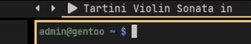

# polybar-mpv

Display current playing file and scrolls the text with [zscroll](https://github.com/noctuid/zscroll#installation), cycle pause and volume control. 

Very simple to edit and easily expandable.


# Dependencies
* [zscroll](https://github.com/noctuid/zscroll#installation)

* [jq](https://stedolan.github.io/jq/download/) (probably available in your distros repo)

* [socat](http://www.dest-unreach.org/socat/) (probably available in your distros repo)

* Font Awesome (optional) if you want the default symbols i used.

# Setup
MAKE SURE ```enable-ipc enable-ipc = true``` is added in your bar config as well.

```move mpv.sh & mpv-zscroll.sh to ~/.config/polybar/scripts/polybar-mpv```

* In your polybar config add
```
[module/mpv]
type = custom/script
exec-if = pidof mpv 
exec = ~/.config/polybar/scripts/polybar-mpv/mpv-zscroll.sh
tail = true
click-left = echo 'cycle pause' | socat - /tmp/mpv_socket 
scroll-up = ~/.config/polybar/scripts/polybar-mpv/mpv.sh --volume-up
scroll-down = ~/.config/polybar/scripts/polybar-mpv/mpv.sh --volume-down
```

* In your mpv config add
```
input-ipc-server=/tmp/mpv_socket
```

* playlist controls (optional)
```
[module/mpv-prev]
type = custom/script
exec-if = pidof mpv
exec = echo ""
click-left = echo 'playlist-prev' | socat - /tmp/mpv_socket
format-underline = ${colors.background}

[module/mpv-next]
type = custom/script
exec-if = pidof mpv
exec = echo ""
click-left = echo 'playlist-next' | socat - /tmp/mpv_socket
format-underline = ${colors.background}
```

